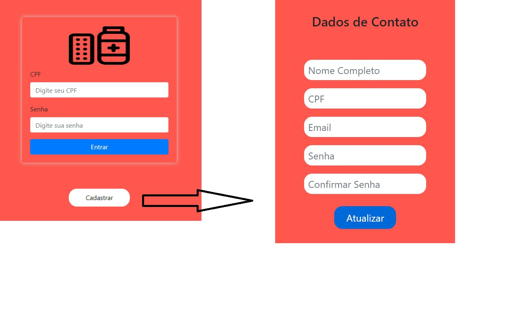
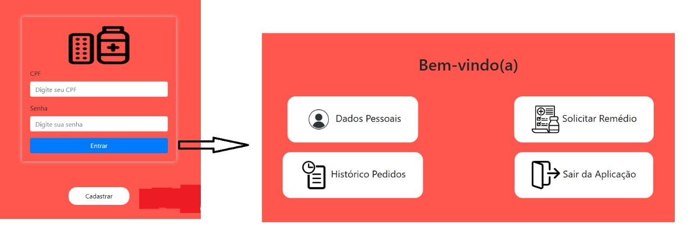
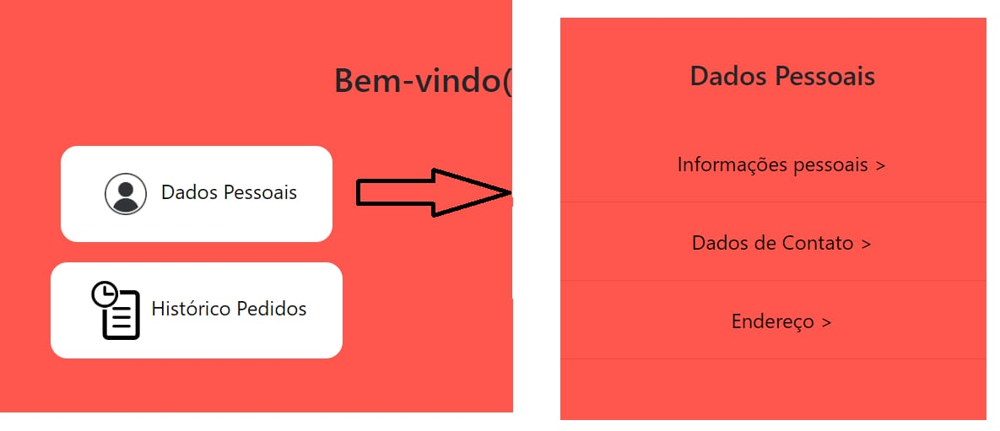
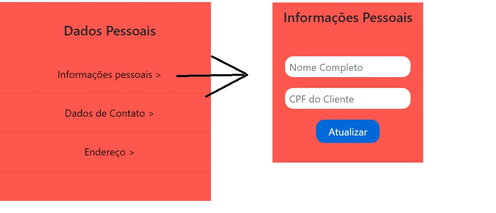
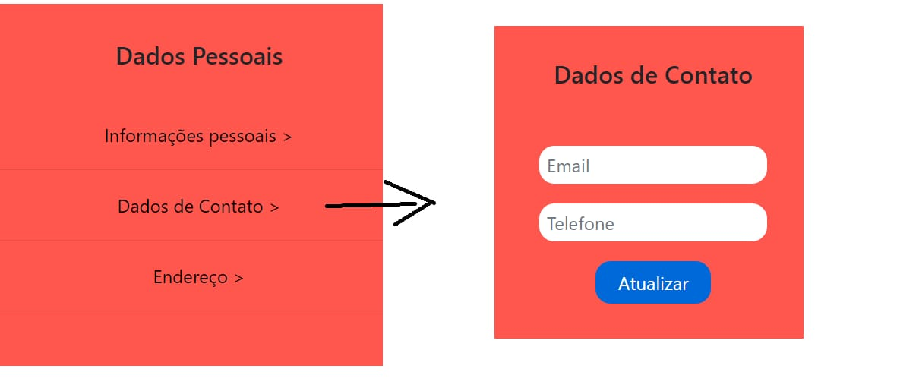
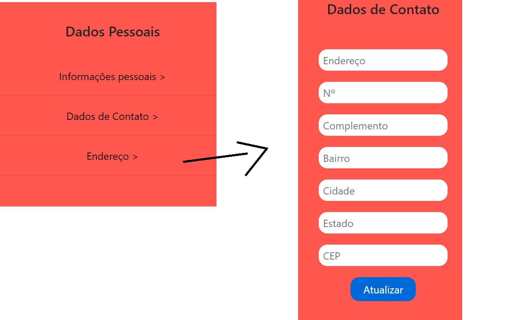
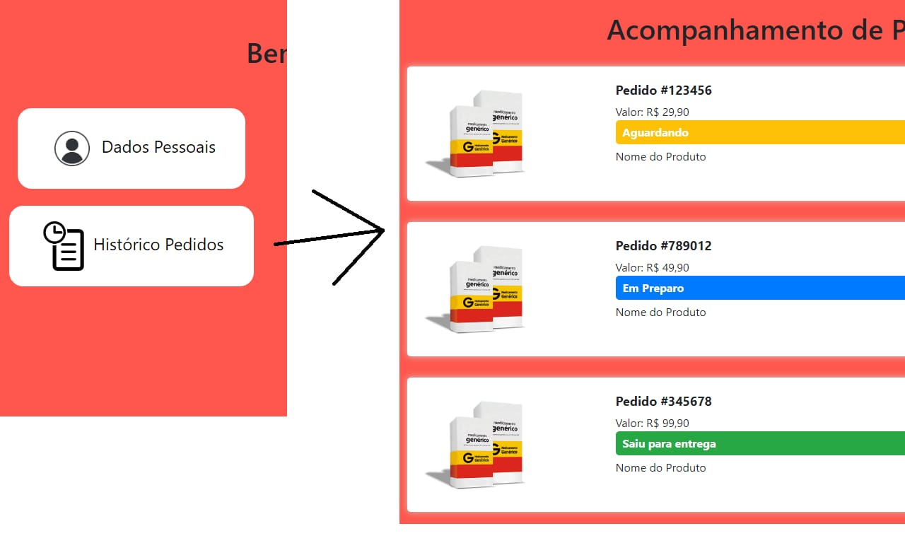
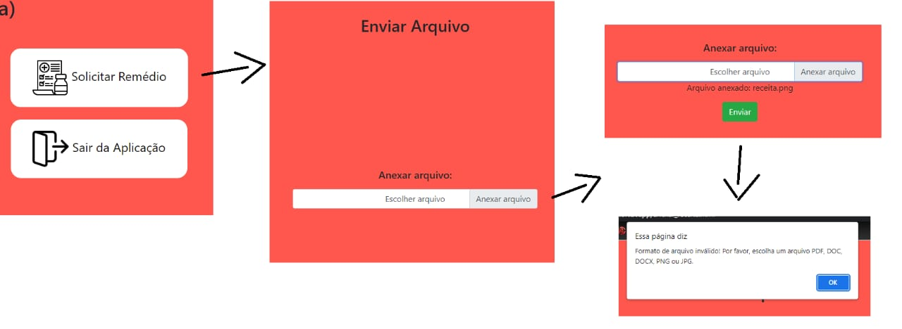
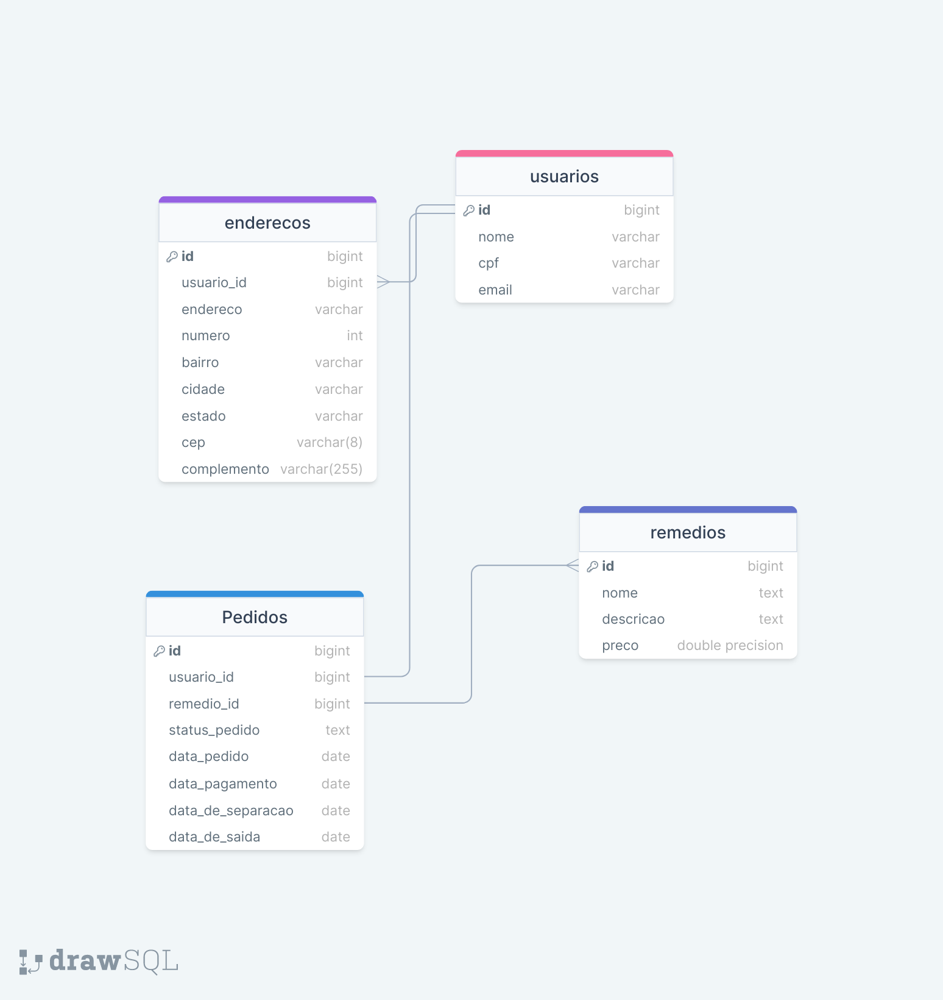

# projeto_integrador
Projeto Integrador Senac matéria de Desenvolvimento de Sistemas Orientado a Objetos Grupo 12.

## Integrantes
* Amanda Ferreira Martins
* Analice Rocha da Silva
* Gianni Lucca Kleiss Gentile 
* Guilherme Dias Palmieri
* Henrique Ferreira Dos Santos 
* Hugo Costa Valencia
* Leonardo Ribeiro Moreira Dos Reis

## Descrição
    A aplicação permite o cadastro de usuários para que possam ter acesso a remédios de forma facilitada.

    Os pacientes poderão escolher entre retirar na loja ou receber o medicamento em casa mediante pagamento de taxa de entrega.

## Como rodar a aplicação

clone o repositorio do projeto
```bash
https://github.com/ggentile/projeto_integrador.git
```
Em seguido dentro da pasta do projeto rode

configuraçao do banco de dados
```bash
docker run --name farmacia -p 5432:5432 -e POSTGRES_PASSWORD=root -d postgres

docker exec -it farmacia psql -U postgres

"No shel do postrgres execute"
create database projeto_farmacia;
CTRL + D para sair do shell

```


```bash
python -m venv .venv
source .venv/scripts/activate (Linux)
.\.venv\scripts\activate (Windows)
pip install -r requirements.txt
```
```
python manage.py runserver
```

## Fluxo de execução









## Diagrama banco de dados


## Jornada do usuário

